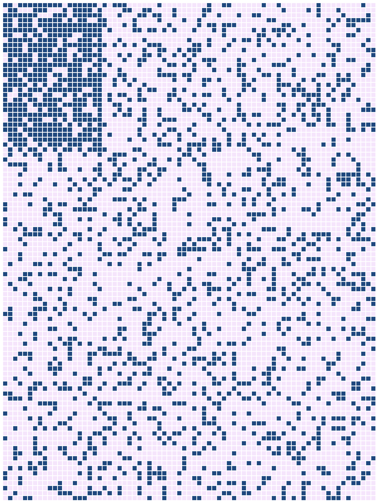
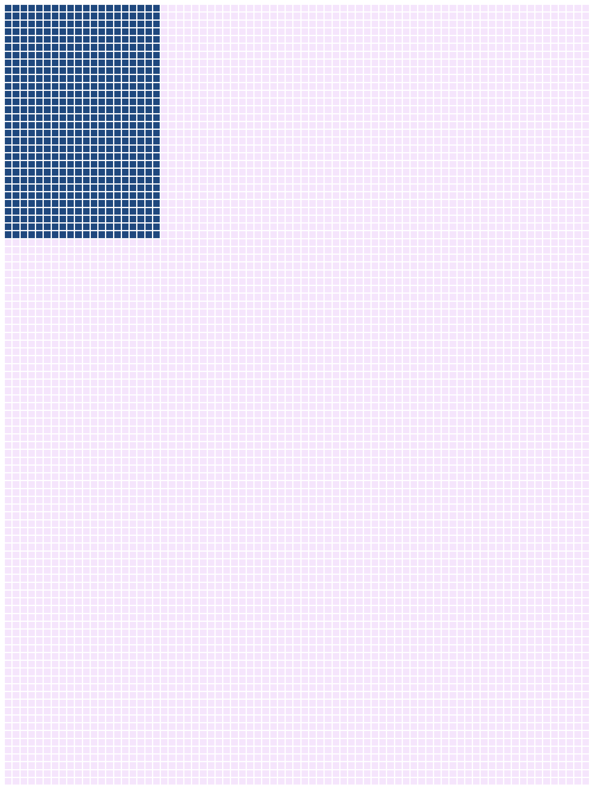
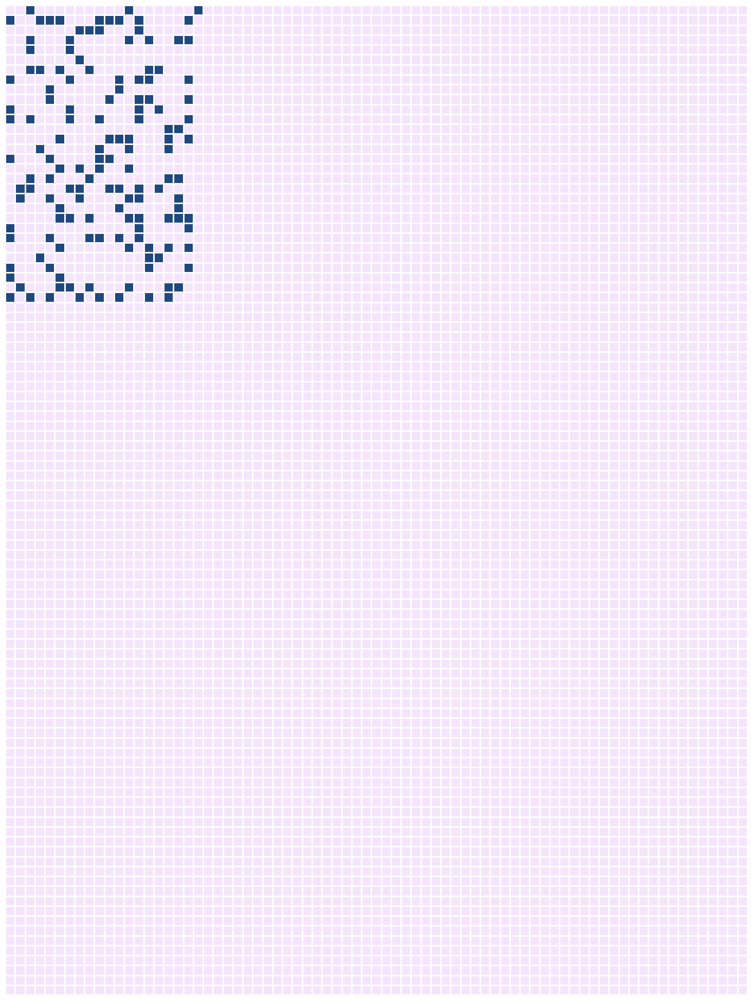
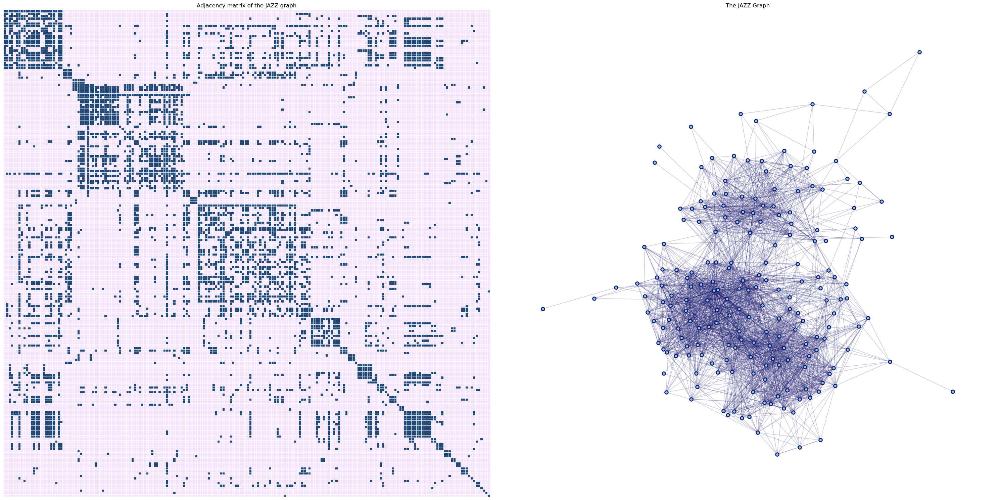
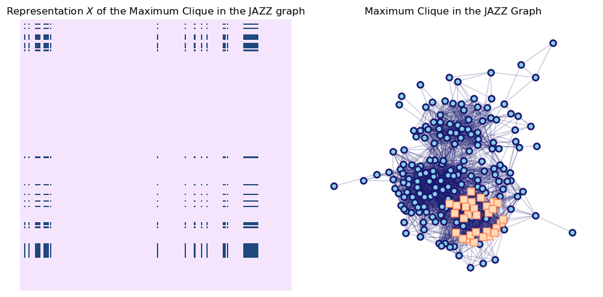

# ENSUB -- ADMM for Elastic-Net (EN) regularized QP for the densest SUBmatrix problem

## Introduction

This is a Python module implementing the algorithms developed in the paper
[Convex optimization for the densest subgraph and densest submatrix problems](https://arxiv.org/abs/1904.03272).

The problem of identifying a dense submatrix is a fundamental problem in the  analysis of matrix structure and complex networks. This code provides tools for identifying the densest submatrix of the fixed size in a given graph/matrix using first-order optimization methods..

See the tutorial below to get started.

## Usage

The `ensub` module contains the following:

- `plantedsubmatrix`: function that generates binary matrix sampled from dense submatrix of particular size.
- `soft_thres`: function for evaluating the vector soft-threholding operator applied to vector of singular values (used in the ADMM updates of  `ENSub`).
- `prob_simplex`: function for projection onto the capped simplex (generalization of probability simplex). Used in the ADMM updates of `ENSub`
- `ENSub`: class of ADMM algorithms for our EN-regularized QP relaxation of the densest subgraph and submatrix problems..

Like other python modules, ``ensub`` can be used after moving it to your file path and loading it:

```{python}
from ensub import *
```

Note we can also load ``ensub`` with a prefix using one of the following.

```python
import ensub
```

```python
import ensub as ds
```

## Examples

We illustrate use of this package with three different types of data:

1. Using random matrices sampled from the planted dense $m \times n$ submatrix model;

2. Using random adjacency matrices of random graphs sampled from the planted dense subgraph model;

3. Using a real-world collaboration network.

### Random Matrices

We generate a random matrix with noise obscuring the planted submatrix using the function ``plantedsubmatrix`` and then use the solver from the ``ENSub`` class to recover the planted submatrix.

We also calculate the spectral norm of $A$, which we later use as augmented Lagrangian penalty parameter $\rho$.

```python
# Dimensions of the full matrix.
M, N = 100, 75

# Dimensions of the dense block.
m, n = 30, 20

# In-group and noise density.
p, q = 0.75, 0.25

# Make binary matrix with planted mn-submatrix
A, X0, Y0 = plantedsubmatrix(M,N,m,n,p,q, seed=42)

rad = np.linalg.norm(A)
```

After generating the random matrix with desired planted structure, we can visually represent the matrix and planted submatrix as two-tone images, where dark pixels correspond to nonzero entries, and light pixels correspond to zero entries.

| Adjacency matrix $A$                                  | Proposed solution $X_0$                                   |Proposed solutions $Y_0$                               |
| ----------------------------------------------------- | ----------------------------------------------------- | ----------------------------------------------------- |
|  |||

The vizualization of the randomly generated matrix  helps us to understand its structure. It is clear that it contains a dense 30 x 20 block (top left corner).

We call our solver with `rho` equal to the spectral radius calculated earlier; otherwise, we use default settings. We choose
$$
    \gamma = \max \left\{ \sqrt{\sigma^2 m \log M}, \log M \right\}
$$
as suggested in the paper, where 
$$\sigma^2 = \max\Big\{p(1-p), q(1-q)\Big\} = \frac{3}{8}$$
for $p=0.75$ and $q=0.25$.

```python
es = ENSub(rho=rad)

sig = max(p*(1-p), q*(1-q))
gam = max(np.sqrt(sig*m*np.log(M)), np.log(M))
u,v, x, y, fval, its = es.solve(A, [m, n], gam)
```

The ``ENSub`` solver returns vectors $u$ and $v$ containing the characteristic vectors of the rows and columns of the dense submatrix.

We can take the outer product of these to visualise the index set of the planted submatrix.

<!--  -->

It must be noted that matrices $X = u v^T$ is identical to the planted solution $X_0$. We can conclude that the planted submatrix is recovered here.

### Symmetric Matrices and Dense Subgraphs

``ENSub`` can also be used to solve the **densest subgraph** problem without modification.

To illustrate this process, we first make a random graph containing $30$ nodes with a hidden dense subgraph with $20$ nodes. We use the same probabilities of edge creation from our previous example.
We sample the random graph using the ``stochastic_block_model`` function from the ``Networkx`` package.

```python
# Size of random matrix.
M = 100

# Size of planted block.
m = 50

# Connectivity probabilities.
ps = [[p, q], [q, q]]

# Sample the graph.
G = nx.stochastic_block_model(sizes=[m, M - m], p=ps, seed=42)

# Generate the adjacency matrix.
AG = nx.adjacency_matrix(G).toarray()
np.fill_diagonal(AG, 1)
```

It is clear from the following visualization that this graph contains a single especially dense subgraph with exactly $50$ nodes.


We can find this subgraph by calling ``ENSub``. Here, we change the optimization parameters from their defaults for illustration purposes. We choose $\gamma$ as in the previous example.

```python
# Set parameters.
my_rho = np.linalg.norm(AG)
tol = 1e-5
maxits = 2000
my_alpha = 0.65

m = 50

# Define 
es = ENSub(rho=my_rho, alpha=my_alpha, opt_tol=tol, maxiter=maxits)

sig = max(p*(1-p), q*(1-q))
gam = max(np.sqrt(sig*m*np.log(M)), np.log(M))
# gam = m/5
u,v,x, y, fval, its = es.solve(AG, [m, m], gam)
clique = np.argsort(u)[::-1][:m]
```

The ``ENSub`` solver converges to the matrix representation of the planted dense subgraph highlighted in the figure below.


#### Exploiting Symmetry

The coefficient matrix $A_G$ is symmetric in this example. We can leverage this symmetry to improve the efficiency and stability of the algorithm.

We call the version of the ENSub solver specialized for the symmetric case by passing the keyword argument ``symmetric=True`` to ``ENSub``.

```python
# Set parameters.
my_rho = np.linalg.norm(AG)
tol = 1e-5
maxits = 2000
my_alpha = 0.8

m = 50

# Define 
es = ENSub(rho=my_rho, alpha=my_alpha, opt_tol=tol, maxiter=maxits, symmetric=True)

sig = max(p*(1-p), q*(1-q))
gam = max(np.sqrt(sig*m*np.log(M)), np.log(M))

u,v, fval, its = es.solve(AG, m, gam)
```

The iterative method terminates within $10$ iterations with the same solution found by the unsymmetric solver.

### The JAZZ Collaboration Data Set

The following is an example on how one could use the package to analyze the collaboration network found in the JAZZ dataset (see [Community Structure in Jazz. Gleiser and Danon. 2003](https://arxiv.org/abs/cond-mat/0307434)).
This is a social/collaboration network where each pair of musicians are linked if they have performed together. The maximum clique in this network contains 30 musicians.

```python
# Read the graph from adjacency list file.
Gjazz = nx.read_adjlist("DEMO/jazz.txt")
Gjazz = nx.convert_node_labels_to_integers(Gjazz, first_label=0, ordering='default', label_attribute=None)

# Generate the adjacency matrix.
Ajazz = nx.adjacency_matrix(Gjazz).toarray()
np.fill_diagonal(Ajazz, 1)
```



We are now ready to try to identify the densest submatrix of size 30 in this adjacency matrix. Here, we set $m=n=\min\{30, \|A_{\text{jazz}}\|_2\}$ in our call to `ENSub`.

In this case, we don't know $p(1-p)$ or $q(1-q)$, but we know that these products are bounded by $1/4$. We substitute $\sigma^2=1/4$ in our earlier formula for $\gamma$.

```python
m = 30
my_rho = min(m,np.linalg.norm(Ajazz))

es = ENSub(rho=my_rho, alpha=0.25, maxiter= 2000, symmetric=True)
gam = max(np.sqrt(0.25*m*np.log(M)), np.log(M))
u,v, _,_,_, _ = es.solve(Ajazz, [m, m], gamma = gam)
```

Our algorithm finds the maximum clique, which has size $30$, corresponding to the group of musicians indexed by nonzero entries of $X$ visualized below.



# How to contribute

- Fork, clone, edit, commit, push, create pull request.


# Reporting bugs and other issues

If you encounter a clear bug, please file a minimal reproducible example on github.
